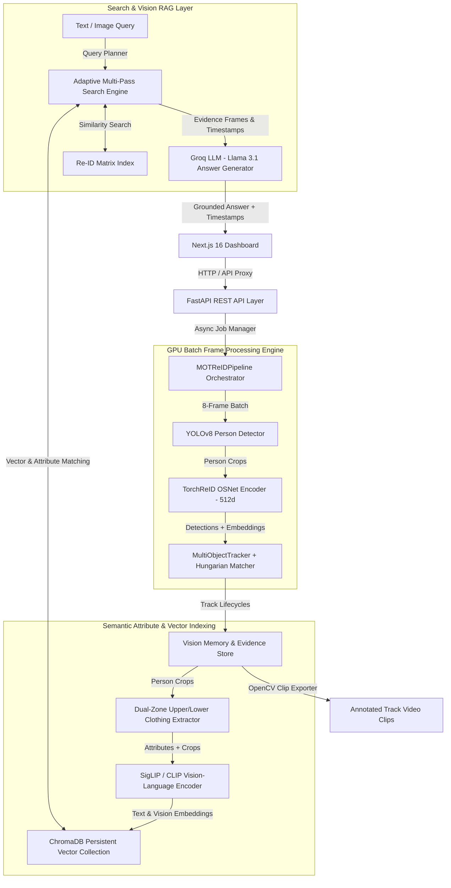

# 🎬 MOT + Re-ID Video Search & Vision RAG System

[](https://www.python.org/)
[](https://nextjs.org/)
[](https://pytorch.org/)
[](https://fastapi.tiangolo.com/)
[](https://docs.ultralytics.com/)
[](https://www.trychroma.com/)
[](https://groq.com/)

A full-stack, enterprise-grade AI system for **Person Detection**, **Multi-Object Tracking (MOT)**, **Person Re-Identification (Re-ID)**, **GPU Batch Processing**, **Dual-Zone Attribute Recognition**, **Vector Search**, and **Grounded Vision RAG (Retrieval-Augmented Generation)**.

---

## 📌 Table of Contents

- [Key Capabilities](#key-capabilities)
- [System Architecture](#system-architecture)
- [Technical Innovations & Core Algorithms](#technical-innovations--core-algorithms)
- [Repository Layout](#repository-layout)
- [Requirements](#requirements)
- [Quick Start Guide](#quick-start-guide)
  - [1. Backend Setup](#1-backend-setup)
  - [2. Frontend Setup](#2-frontend-setup)
- [API Reference](#api-reference)
- [Configuration & Environment Variables](#configuration--environment-variables)
- [Privacy & Consent](#privacy--consent)
- [Testing](#testing)
- [Troubleshooting](#troubleshooting)

---

## ⚡ Key Capabilities

1. **GPU Batch Frame Processing**: Reads video frames in chunks (default 8 frames per batch) to execute batched YOLO detection and TorchReID feature encoding, accelerating pipeline throughput by **3x to 5x**.
2. **Dual-Zone Clothing Attribute Recognition**: Automatically segments detected person crops into upper-body (*shirt, jacket, top*) and lower-body (*trousers, pants, jeans*) zones to index detailed appearance color descriptions.
3. **Multi-Object Tracking (MOT) & Hungarian Matcher**: Combines motion displacement, IoU, center distance, bounding box shape cost, and Re-ID cosine similarity for stable identity tracking across long occlusions.
4. **Re-ID Diversity Gallery**: Maintains up to 8 distinct normalized 512-dimensional embeddings per track to handle pose, lighting, and camera angle variations during similarity search.
5. **Natural Language Vision RAG**: Searches video observations via HuggingFace SigLIP/CLIP embeddings and ChromaDB vector search. Generates grounded LLM answers using Groq (`llama-3.1-8b-instant`).
6. **Person Image Search**: Compares an uploaded query image against active tracks and persisted embedding galleries using a hybrid face + appearance scoring pipeline.
7. **Evidence Capture & Video Clip Export**: Automatically isolates track visual evidence and exports annotated MP4 video segments with bounding box overlays.
8. **Non-Blocking Session-Isolated API**: Isolates runtime jobs by session ID while read-only search and analytics endpoints operate concurrently without locking video processing.

---

## 🏗️ System Architecture



---

## 🧠 Technical Innovations & Core Algorithms

### 1. Global Data Association (Hungarian Algorithm)
The tracking engine calculates a unified global cost matrix between existing tracks $i$ and frame detections $j$:

$$\text{Cost}_{i,j} = w_{\text{app}} \cdot \text{Cost}_{\text{appearance}} + (1 - w_{\text{app}}) \cdot \left(0.68 \cdot \text{Cost}_{\text{IoU}} + 0.24 \cdot \text{Cost}_{\text{center}} + 0.08 \cdot \text{Cost}_{\text{shape}}\right)$$

Where global assignment is solved via SciPy's Linear Sum Assignment algorithm (`linear_sum_assignment`).

### 2. Dual-Zone Upper/Lower Body Color Segmentation
Person bounding box crops are divided vertically into upper half ($0 \dots \frac{H}{2}$) and lower half ($\frac{H}{2} \dots H$). Dominant RGB colors are computed and matched against calibrated Euclidean color centroids (black, white, red, yellow, green, blue, gray) to index multi-attribute search tags without heavy VLM latency.

### 3. Adaptive Multi-Pass Query Planner
User natural language queries undergo multi-stage execution:
1. **Pass 1 (Exact Match)**: Enforces all explicit color, object, and spatial location filters.
2. **Pass 2 (Controlled Relaxation)**: Softens secondary constraints (e.g. spatial zone) if exact evidence is limited.
3. **Pass 3 (No-Result Guidance)**: Provides actionable guidance tips to refine search terms.

---

## 📁 Repository Layout

```text
app/
  main.py                FastAPI entrypoint, CORS setup, login and protected media downloads.
  routes/tracking.py     API endpoints: /run, /upload, /jobs, /search, /search/text, /analytics, /clips.
  services/
    pipeline.py          Pipeline orchestrator with process_frames_batch GPU batching.
    runtime.py           Session-scoped pipeline registry and job manager singleton.
    jobs.py              Thread pool background job manager with cancel/retry capabilities.
    semantic_search.py   Dual-zone clothing attribute parser, CLIP encoder, ChromaDB vector search.
    memory_engine.py     Evidence crop generator, position tracker, episode summary builder.
    persistence.py       SQLite metadata store and .npy embedding vector persistence.
    reid_index.py        Memory vector matrix and similarity search index.
    clip_export.py       Video segment exporter for track memories.
    rag.py               Groq LLM RAG answer generator over retrieved evidence.
    model_cache.py       Thread-safe singleton model cache (YOLO, Re-ID, CLIP).

models/
  yolo.py                YOLOv8 detector wrapper supporting single and batch inference.
  reid_model.py          TorchReID OSNet encoder with fallback logging.

tracking/
  tracker.py             Multi-object tracker, track lifecycle, and gallery maintenance.
  matcher.py             Cost matrix calculations (IoU, center distance, shape, cosine distance).

utils/
  image.py               Bounding box cropper utility.
  visualization.py       OpenCV video frame annotation.

Frontend/
  app/page.js            Next.js 16 dashboard UI.
  app/api/[...path]/     Server-side proxy forwarding API requests to FastAPI backend.
  next.config.mjs        Next.js configuration (distDir: .next-build).

data/users/<session-id>/ Runtime storage isolated per authenticated login session:
  input/uploads/         Uploaded video files.
  output/                Annotated tracking videos.
  crops/                 Saved person bounding box images.
  evidence/              Annotated full-frame evidence screenshots.
  clips/                 Exported track video clips.
  embeddings/            Persisted Re-ID embedding matrices (.npy).
  semantic_chroma/       Persistent ChromaDB vector collection.
  mot_reid.sqlite3       SQLite database storing run memories.
```

---

## 🛠️ Requirements

- **Python**: `3.10` or newer
- **Node.js**: `20.9` or newer
- **npm**: `9` or newer
- **OS**: macOS, Linux, or WSL
- **Hardware**: GPU (CUDA) recommended for high FPS, CPU supported.

---

## 🚀 Quick Start Guide

### 1. Backend Setup

```bash
# 1. Create and activate a Python virtual environment
python3 -m venv .venv
source .venv/bin/activate

# 2. Install dependencies
pip install -r requirements.txt

# 3. Launch FastAPI server
uvicorn app.main:app --reload --reload-dir app --reload-dir tracking --reload-dir models --reload-dir utils --host 127.0.0.1 --port 8000
```

Verify backend health:
```bash
curl http://127.0.0.1:8000/health
```

### 2. Frontend Setup

In a new terminal tab:

```bash
cd Frontend
npm install
npm run dev
```

Open `http://localhost:3000` in your browser.

---

## 📡 API Reference

### Health & Analytics
| Method | Endpoint | Description |
| :--- | :--- | :--- |
| `GET` | `/health` | System status, GPU availability, data directories |
| `GET` | `/tracking/analytics/dashboard` | Overall track count, active tracks, frames processed |
| `GET` | `/tracking/analytics/tracks` | List indexed track memories |

All `/tracking/*` and `/media/*` endpoints require a token from `POST /auth/login`. The backend keeps the token in an HTTP-only cookie for browser media requests and derives the private data namespace from the token; `x-session-id` is not used for identity.

### Video Processing & Jobs
| Method | Endpoint | Description |
| :--- | :--- | :--- |
| `POST` | `/tracking/upload` | Upload video file and start background tracking job |
| `GET` | `/tracking/jobs` | List background jobs in active session |
| `GET` | `/tracking/jobs/{job_id}` | Check status/progress of background job |
| `POST` | `/tracking/jobs/{job_id}/cancel` | Request cancellation of running job |

### Search & RAG
| Method | Endpoint | Description |
| :--- | :--- | :--- |
| `POST` | `/tracking/search` | Search person by uploaded crop image (Form-Data: `file`) |
| `POST` | `/tracking/search/text` | Search person by natural language text query (JSON) |
| `POST` | `/tracking/clips/{memory_id}` | Export MP4 video clip for a specific track memory |

#### Text Search Payload Example:
```json
{
  "query": "man in red shirt and dark pants",
  "top_k": 5,
  "use_llm": true
}
```

---

## ⚙️ Configuration & Environment Variables

Root `.env` file configuration:

```env
BACKEND_PORT=8000
FRONTEND_PORT=3000
CORS_ORIGIN=http://localhost:3000
LOG_LEVEL=INFO
MOT_REID_CACHE_DIR=data/cache
MOT_REID_MAX_UPLOAD_BYTES=536870912
MOT_REID_AUTH_USERNAME=admin
MOT_REID_AUTH_PASSWORD=use-a-long-random-password
MOT_REID_AUTH_SECRET=use-a-long-random-signing-secret
MOT_REID_ALLOW_SIGNUP=false
MOT_REID_AUTH_DB=data/auth/users.sqlite3
COOKIE_SECURE=true

# Google sign-in (optional). Register this public callback URL in Google Cloud Console.
GOOGLE_OAUTH_CLIENT_ID=
GOOGLE_OAUTH_CLIENT_SECRET=
MOT_REID_GOOGLE_REDIRECT_URI=https://your-app.com/api/auth/google/callback
# Set true only when any verified Google account may create an operator account.
MOT_REID_ALLOW_GOOGLE_SIGNUP=false

# Groq LLM API Key for grounded Video RAG answer generation
GROQ_API_KEY=your_groq_api_key_here
GROQ_MODEL=llama-3.1-8b-instant
```

Frontend `.env` (`Frontend/.env`):
```env
API_BASE_URL=http://127.0.0.1:8000
```

---

## Privacy & Consent

- **Face and person embeddings are sensitive biometric data.** Process video only when you have consent, legal authorization, and a clear retention/deletion policy for generated crops, evidence frames, embeddings, clips, and SQLite records under `data/`.
- **Groq RAG sends data to an external provider when enabled.** If `GROQ_API_KEY` is configured and text search uses `use_llm: true`, the backend sends the text query plus retrieved evidence metadata such as captions, track IDs, timestamps, bounding boxes, source labels, and scores to Groq for answer generation.
- **Do not upload or analyze third-party footage without approval.** Review Groq's terms and privacy policy before enabling LLM answers in production, and disclose this external data sharing to users/operators.
- **Data is isolated per login session.** Generated media and databases are stored below `data/users/<session-id>/`; the reset action only deletes the authenticated session's namespace.

---

## 🧪 Testing

Run the automated test suite:

```bash
.venv/bin/python -m pytest
```

---

## ❓ Troubleshooting

- **TorchReID Fallback to Histogram**: Ensure `tensorboard` is installed (`pip install tensorboard`) and `data/cache` is writable.
- **RAG Answer Unavailable**: Verify `GROQ_API_KEY` is specified in root `.env`.
- **Text Search Returns No Matches**: Ensure a video has been processed in the current session so observations are indexed in ChromaDB.
